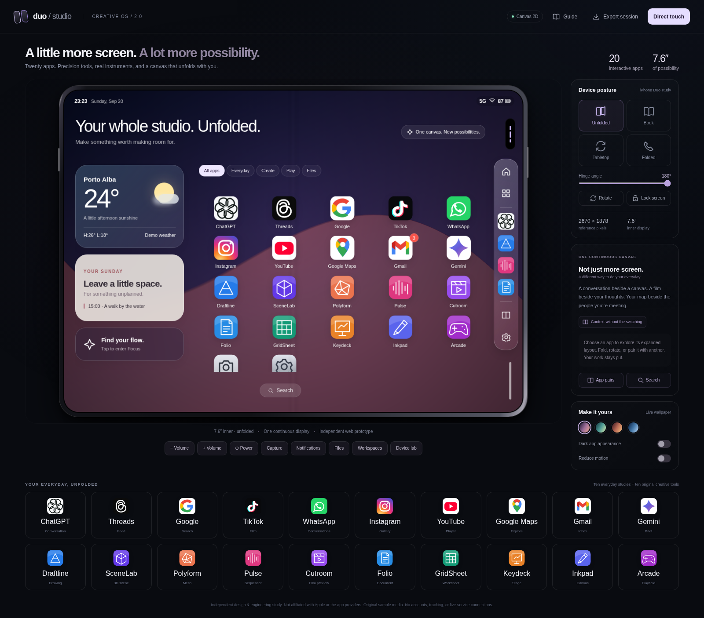

# Duo Studio · Creative OS 2.0

An independent, twenty-app creative studio inside a folding-device simulator. HTML, JavaScript, WebGPU, Canvas 2D, Web Audio, IndexedDB, and original inline media. No runtime packages, sign-in, telemetry, or external service dependency.

**[Open the simulator](https://wieslawsoltes.github.io/DuoStudio/)** · **[Standalone HTML](https://wieslawsoltes.github.io/DuoStudio/duo-studio.html)** · **[Complete source ZIP](https://wieslawsoltes.github.io/DuoStudio/downloads/duo-studio-source.zip)**



## Ten new creative applications

| Application | Working tools | Interchange |
|---|---|---|
| Draftline | Precision 2D drawing, command bar, snapping, dimensions, layers, selection, duplication and editable properties | DXF subset, SVG, PNG, project JSON |
| SceneLab | Primitive and imported-mesh scene composition; orbit, pan, ray picking, transforms, object visibility, solid/wire rendering | OBJ import/export, ASCII STL, PNG, project JSON |
| Polyform | Editable profiles, lathe and twisted extrusion, polygon triangulation and subdivision | OBJ, STL, direct mesh transfer into SceneLab |
| Pulse | Synthesized drum machine and polyphonic instrument, 16/32 steps, swing, velocity, piano audition, pan, filter, mute and solo | Actual offline stereo WAV render, MIDI, project JSON |
| Cutroom | Sequential timeline, source trims, splits, ordering, speed, volume, captions, color looks and fades | Local video import; actual real-time recorded video output using browser codecs |
| Folio | Rich text, headings, lists, tables, selection formatting, document outline, find/replace | DOCX subset, HTML, Markdown/text, project JSON |
| GridSheet | Virtualized editable worksheet; safe formula interpreter, ranges, relative/absolute fill, formats, sorting and charts | Single-sheet XLSX subset, CSV/TSV, SVG charts, project JSON |
| Keydeck | Editable slides, visual layouts, artwork, notes, reordering and presenter mode | PPTX text/color subset, self-contained HTML deck, SVG/PNG, project JSON |
| Inkpad | Pressure-aware painting, erasing, flood fill, shapes, eyedropper, bitmap layers, layer opacity and merge | PNG, image import, editable layered project JSON |
| Arcade | Prism Break, Neon Serpent and Merge 2048; pointer/keyboard/touch controls, score persistence and lifecycle suspension | Local high scores |

The original ten local studies remain: ChatGPT, Threads, Google, TikTok, WhatsApp, Instagram, YouTube, Google Maps, Gmail and Gemini. Each now has workspace save/export and scoped undo/redo controls, plus a creative handoff. Those studies are not connected to the corresponding companies' services. AI-style output uses local templates; email and chat do not leave this application.

## Simulator experience

Fold, unfold, rotate, enter Book/Tabletop modes, adjust a hinge fixture, or set custom logical viewport dimensions. App instances and document state survive layout transitions. Pair applications horizontally or vertically, resize with pointer or keyboard, save named app pairs, or choose one of six creative workspaces. Direct-touch mode fits the real browser viewport rather than shrinking a desktop simulation.

The launcher adds categories, drag reordering, long-press/context-menu dock customization and Spotlight. The app switcher shows running instances, supports closing individual apps and suspending background work. Local notifications, Focus, lock/unlock, inactivity lock, volume keys, full-screen mode, simulated battery/network/location signals, layout/safe-area/touch overlays, larger text, contrast, grayscale and reachability controls support interface exploration.

The Files cabinet uses IndexedDB where available, with an explicitly labeled memory fallback. Save projects, rename/download/open/delete files, and back up the complete studio to a CRC-checked ZIP. Restore validates the session and all file entries before atomically merging cabinet records. App preferences/session data and the cabinet use separate browser storage systems: persistence cannot be guaranteed when the browser denies storage or runs out of quota.

Scenario recording stores data-only app actions, fields, folding changes and normalized canvas gestures with a starting snapshot. Replay does not execute arbitrary code. Imported scenarios are validated and the UI asks before replacing current app state. Record demonstration content, not confidential material: typed text and project state are intentionally part of the recording.

Tab/display capture uses the browser's real chooser and permission prompt. It does not fabricate simulator screenshots. Export a still PNG or a bounded recorded capture. Installation is opt-in from **Device lab → Enable offline installation**; supported browsers can then install the application and reopen it offline.

## Cross-app workflows

* Draw a profile in **Polyform**, send its actual mesh to **SceneLab**, then export STL or OBJ.
* Plan a fictional route in **Maps**, send its connected line segments to **Draftline**, annotate and export DXF.
* Send a bundled film from **YouTube/TikTok** to **Cutroom**, trim/split it and render a new playable video.
* Paint in **Inkpad**, send the composed image into **Instagram**, or open an Instagram image as a painting layer.
* Move ChatGPT's editable canvas or mail/conversation context into **Folio**; send a Gemini board into **Keydeck** as editable slide content.

## Run and build

Open `duo-studio.html` directly for the offline standalone experience. An HTTP/HTTPS origin is needed for browser persistence, installation and permission-gated APIs.

```sh
python3 scripts/build.py
python3 scripts/serve.py
# http://localhost:8000/duo-studio.html
```

The build inlines all JavaScript, CSS, six original images and three original films. It also writes the PWA manifest, original PNG icons, versioned service worker and SHA-256 build manifest into `dist/`. Assets are included; regenerating them is optional and needs `requirements-assets.txt` plus FFmpeg.

```sh
node scripts/check.mjs
python3 -m pip install -r requirements-dev.txt
python3 -m playwright install chromium
# Set CHROMIUM to your installed Playwright Chromium executable or pass --chromium.
python3 tests/test_browser.py
python3 tests/test_creative.py
python3 tests/test_hosted.py
python3 scripts/capture_v2.py
python3 scripts/package_repository.py
```

GitHub Actions runs the source checks, original-app regressions, creative/system tests, normal-origin tests and screenshot capture. Pull requests validate without deploying. Pushes to `main` publish Pages with source downloads; a separate job verifies the public HTML, app inventory and ZIP checksums.

## Implementation boundaries

This is an independent **browser interaction simulator**, not Apple's iOS simulator or an emulator of native iPhone applications. Display dimensions and folding postures are configurable design assumptions. There is no physical hinge sensor, host battery/network override, App Store installation, cellular stack, native app execution or complete platform accessibility emulation.

The creative apps implement the tools documented above; they are not full AutoCAD, Blender, professional DAW/NLE, or Microsoft Office replacements. Office interchange supports documented subsets, not lossless arbitrary documents. CAD has no NURBS, parametric constraint solver or solid Boolean kernel. Pulse does not host plug-ins; Cutroom is one sequential video track with real-time browser-codec export. Maps is fictional, not geographic navigation. Hardware capture and camera APIs remain browser- and permission-dependent.

WebGPU is used for wallpaper compute/presentation and the 3D geometry renderers. HTML/CSS/SVG provide the editable interfaces; drawing, video compositing and games use Canvas 2D. Web Audio generates and renders sound. The renderer identifies its actual backend and retains a Canvas fallback. Software-adapter CI execution is not a physical-GPU performance measurement.

See [V2 guide](docs/CREATIVE_OS.md), [architecture](docs/ARCHITECTURE_V2.md), [testing](docs/TESTING_V2.md), [format support](docs/FORMATS_V2.md) and [deployment](docs/DEPLOYMENT.md).

MIT for original implementation and original bundled media; third-party names identify independent local interface studies and remain their owners' trademarks. No third-party font files are distributed.
